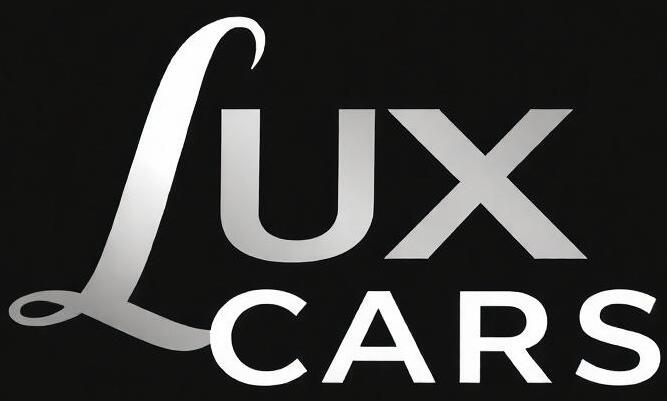

  
  <h1>LuxCars</h1>
  <h3>Site de Venda e Seguro de Carros de Luxo</h3>

---

## 📖 Índice

1. [Acesso](#-acesso)
2. [Resumo do Projeto](#-resumo-do-projeto)
3. [Estrutura do Site](#estrutura-do-site)
4. [Organização da Estrutura de Pastas](#organização-da-estrutura-de-pastas)
5. [Responsividade e Boas Práticas](#responsividade-e-boas-práticas)
6. [Tecnologias Utilizadas](#-tecnologias-utilizadas)
7. [Layouts](#-layouts)
8. [Colaboradores](#colaboradores)

## 🖱 Acesso

Para acessar o site, clique [aqui](https://luxcars.vercel.app/).

## 🔍 Resumo do Projeto

Este projeto foi desenvolvido ao longo de 5 dias na **Residência SerraTec - Software** para aplicar conceitos fundamentais de desenvolvimento front-end, incluindo responsividade, reutilização de código, organização da estrutura de pastas e boas práticas de versionamento com Git. O site é voltado para a venda de carros de luxo personalizados e seguros, proporcionando uma interface funcional e visualmente atraente.

## 🏗 Estrutura do Site

O site é composto por 7 páginas principais, cada uma com um propósito específico:

- **Index.html**: Apresenta a empresa e seus principais serviços.
- **Orçamento.html**: Dedicada à solicitação de orçamento, integra a API ViaCep para o preenchimento automático dos campos de endereço ao inserir o CEP.
- **Desenvolvedores.html**: Apresenta os desenvolvedores responsáveis pelo site e suas contribuições.
- **Seguros.html**: Detalha as opções de seguros oferecidos para os carros de luxo.
- **Carros.html**: Exibe a lista de carros de luxo personalizados à venda, com detalhes sobre cada modelo.
- **Termos.html**: Descreve os termos e condições de uso.
- **Contatos.html**: Disponibiliza as informações de contato da empresa para suporte e dúvidas dos clientes.

## 📁 Organização da Estrutura de Pastas

A estrutura do projeto foi organizada de maneira clara e eficiente, separando os arquivos por funcionalidade para garantir uma manutenção simplificada. Na raiz do projeto, o arquivo principal `index.html` está localizado junto com a pasta `src`, que contém todos os recursos e arquivos de desenvolvimento em pastas e subpastas.

## 📱 Responsividade e Boas Práticas

A responsividade foi um aspecto central no desenvolvimento do site, garantindo que ele se adapte perfeitamente a diferentes dispositivos e tamanhos de tela. O projeto foi versionado utilizando Git, buscando colocar commits claros e descritivos, facilitando o rastreamento de alterações e contribuindo para o trabalho em equipe.

## 🎯 Tecnologias Utilizadas

- HTML
- CSS
- JavaScript
- Bootstrap
- API ViaCep

## 💻 Layouts

- **Tela inicial do site:**
  

- **Outras partes do site:**
  

## 🤝 Colaboradores

- [Francisco Nascimento](https://github.com/francisconascimento4490)
- [Gabriel Toledo](https://github.com/gabrieltol7do)
- [Matheus Lopes](https://github.com/math3us-lopes)
- [Lucas Schumacker](https://github.com/schumacker1)
- [Thallis Matos](https://github.com/thallismatos)

---

**Sinta-se à vontade para contribuir ou fazer perguntas sobre o projeto!**